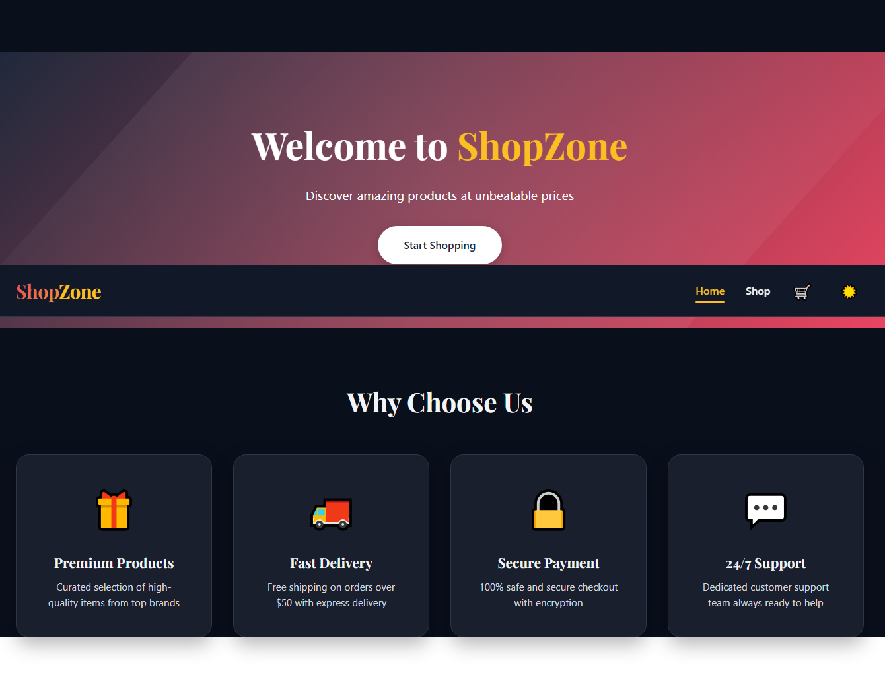
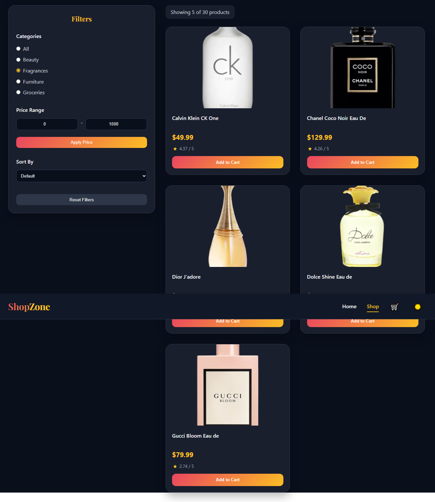
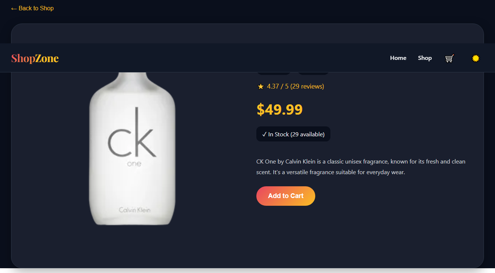
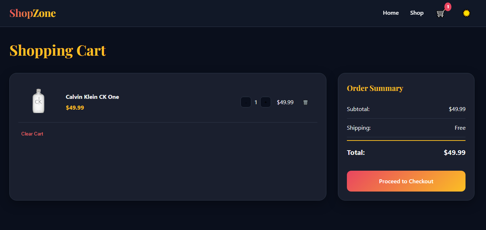
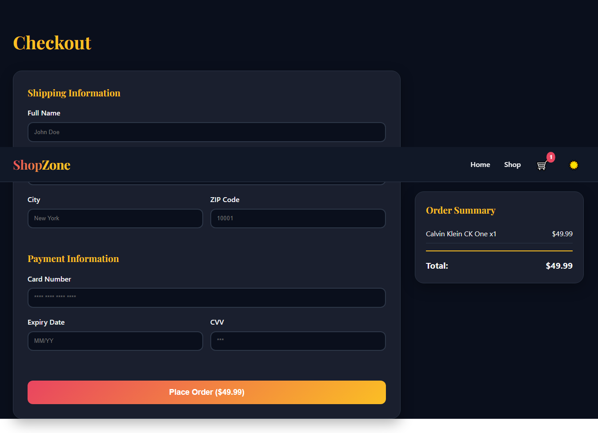

# ShopZone - E-Commerce Application

A fully functional e-commerce web application built with React.js and Redux Toolkit. Features include product browsing, advanced filtering, shopping cart management, theme switching, and protected routes.

## Live Demo

[Add your deployed link here]

## Screenshots







## Features

### Core Features
- **Product Catalog** - Browse products from DummyJSON API
- **Advanced Filtering** - Filter by category, price range, and search
- **Sorting** - Sort products by price (low-high, high-low)
- **Shopping Cart** - Add/remove items, update quantities
- **Cart Persistence** - Cart data saved in localStorage
- **Product Details** - View detailed product information
- **Theme Manager** - Dark/Light mode toggle with persistence

### Redux Implementation
- **Centralized State Management** - Cart, filters, and theme in one store
- **Three Redux Slices** - cartSlice, filterSlice, themeSlice
- **LocalStorage Sync** - Data persists after page refresh
- **Redux DevTools** - Track all state changes

### Routing & Navigation
- **React Router** - Multi-page navigation without reload
- **Dynamic Routes** - Product detail pages with URL parameters
- **Protected Routes** - Checkout page only for logged-in users
- **Guest Login** - Quick access without registration

## Technologies Used

- **React.js** - Frontend library
- **Redux Toolkit** - State management
- **React Router DOM** - Navigation
- **CSS3** - Styling with theme variables
- **DummyJSON API** - Mock product data
- **LocalStorage** - Data persistence

## Project Structure
shopzone/
├── src/
│ ├── components/
│ │ ├── Navbar.js # Navigation with cart badge
│ │ ├── ProductCard.js # Product display card
│ │ ├── FilterSidebar.js # Filter controls
│ │ └── ProtectedRoute.js # Route guard
│ ├── pages/
│ │ ├── Home.js # Landing page
│ │ ├── Shop.js # Product listing
│ │ ├── ProductDetail.js # Single product view
│ │ ├── Cart.js # Shopping cart
│ │ ├── Login.js # Authentication
│ │ └── Checkout.js # Order placement
│ ├── redux/
│ │ ├── store.js # Redux store config
│ │ └── slices/
│ │ ├── cartSlice.js # Cart state & actions
│ │ ├── filterSlice.js # Filter state & actions
│ │ └── themeSlice.js # Theme state & actions
│ ├── App.js # Main component
│ ├── App.css # Global styles
│ └── index.js # Entry point
├── public/
├── package.json
└── README.md


## 🚦 Getting Started

### Prerequisites
- Node.js (v14 or higher)
- npm or yarn

## Installation

1. Clone the repository**
```bash
git clone https://github.com/yourusername/shopzone.git
cd shopzone
Install dependencies

bash
npm install
Start development server

bash
npm start
Open in browser

text
http://localhost:3000
Build for Production
bash
npm run build
Serve Production Build
bash
npx serve -s build
Features in Detail
Shopping Cart
Add products from shop or product detail page

Update quantities (+/- buttons)

Remove individual items

Clear entire cart

Real-time total calculation

Cart badge showing item count

Data persists after page refresh

Filtering System
Category filter (All, Beauty, Fragrances, Furniture, Groceries)

Price range filter (min/max with apply button)

Sort by (Default, Price Low-High, Price High-Low)

Search by product name

Reset all filters button

Real-time product grid updates

Theme Manager
Dark/Light mode toggle

Theme preference saved in localStorage

Smooth transitions

Color palette:

Light: Beige background, Navy text, Gold accents

Dark: Dark navy background, Light text, Red accents

Routing & Authentication
Home, Shop, Product Detail, Cart, Login, Checkout pages

Dynamic routing for products (/product/:id)

Protected route for checkout

Guest login functionality

Redirect to login if not authenticated

Responsive Design
Mobile-friendly layout

Grid system adapts to screen size

Collapsible filter sidebar on mobile

Touch-friendly buttons

Configuration
API Endpoints Used
text
GET https://dummyjson.com/products          # Fetch all products
GET https://dummyjson.com/products/:id      # Fetch single product
localStorage Keys
text
cart    # Stores cart items array
theme   # Stores darkMode boolean
user    # Stores user information
Testing the Application
Test Redux State
Install Redux DevTools Chrome extension

Open DevTools → Redux tab

Add to cart → see cart/addToCart action

Apply filters → see filters/setCategory action

Toggle theme → see theme/toggleTheme action

Test Cart Persistence
Add items to cart

Refresh the page

Cart items should still be there

Test Protected Route
Try to go to /checkout directly

Should redirect to login page

Login as guest

Should access checkout page

Key Learnings
This project helped me understand:

Redux Toolkit implementation with slices

Centralized state management

LocalStorage for data persistence

React Router for navigation

Protected routes implementation

Performance optimization with useMemo

Theme management with CSS variables

Filtering and sorting logic

API data fetching

Credits
API: DummyJSON for providing mock product data

Icons: React Icons library

Font: Google Fonts (Poppins, Playfair Display)
